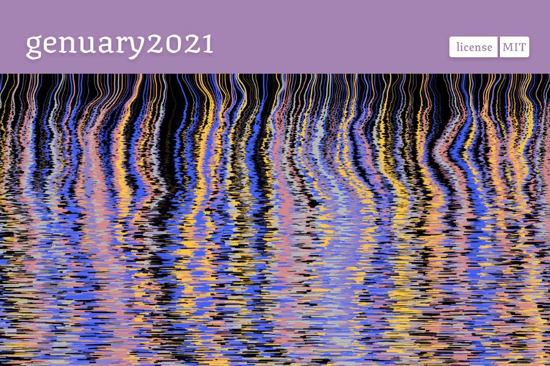

#### A small collection of JavaScript programs with visual output written for the [#genuary2021](https://genuary2021.github.io/) challenge on my [instagram](https://www.instagram.com/_matthiasjaeger/). Click on the image to visit a demo or use the link in the the title to get the code for each sketch. I used [p5-js](https://p5js.org) as my main renderer and these self written tools: [p5-toolkit](https://github.com/matthias-jaeger-net/p5-toolkit), [p5-glitch-effects](https://github.com/matthias-jaeger-net/p5-glitch-effects), [colorful-stripes](https://github.com/matthias-jaeger-net/colorful-stripes). All examples are stored in [genuary2021](https://github.com/matthias-jaeger-net/genuary2021) and hosted live as github pages [here](https://matthias-jaeger-net.github.io/genuary2021/).


### All Challenges


### 2021-01-01 | Triple nested loop

#### In this program explored the flow of a triple nested for loop in a webgl canvas. I create a three-dimensional grid of boxes in the center of the canvas. Each box is rotated and scaled with a value from the `noise()` function to get this fluid look.

Links: [Code](https://github.com/matthias-jaeger-net/genuary2021/tree/main/code/genuary-01), [Live Demo](https://matthias-jaeger-net.github.io/genuary2021/code/genuary-01/)


### 2021-01-02 | rule 30
#### I went for the standard 2D implementation with a initial randomly seeded row and then took it to 3D. I render cells that are alive as textured boxes and dead cells as textured planes. I modulate the height of the boxes with 2D noise for decorative reasons.

Links: [Code](https://github.com/matthias-jaeger-net/genuary2021/tree/main/code/genuary-02), [Live Demo](https://matthias-jaeger-net.github.io/genuary2021/code/genuary-02/)


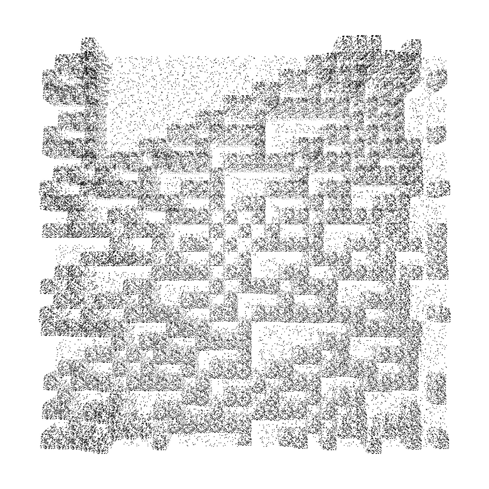


### 2021-01-03 | Make something human

#### During the lockdons due to the corona virus I missed seeing my human friends in real life the the most. When feeling lonely I'd take an A3 page and doodle large imaginairy faces with a big brush and acrylic paint. I'm not such a good painter, so I didn't share these portraits so far. For today's challenge I overlay the images with effects from my javascript library and gave them a final touch in the digital world.

Links: [Code](https://github.com/matthias-jaeger-net/genuary2021/tree/main/code/genuary-03), [Live Demo](https://matthias-jaeger-net.github.io/genuary2021/code/genuary-03/)

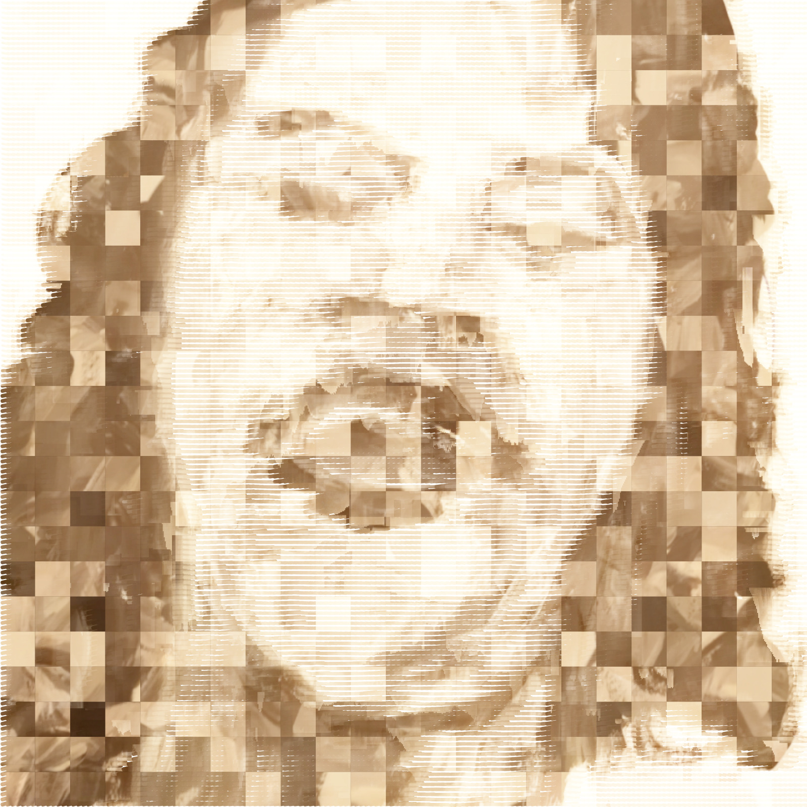


### 2021-01-04 |  Small areas of symmetry

#### I traveled along random angles of a circle and at every angle sketched a rectangle on the page. Using my function sym() I cut small areas of the canvas and show the image next to a reflected version of itself.

Links: [Code](https://github.com/matthias-jaeger-net/genuary2021/tree/main/code/genuary-04), [Live Demo](https://matthias-jaeger-net.github.io/genuary2021/code/genuary-04/)

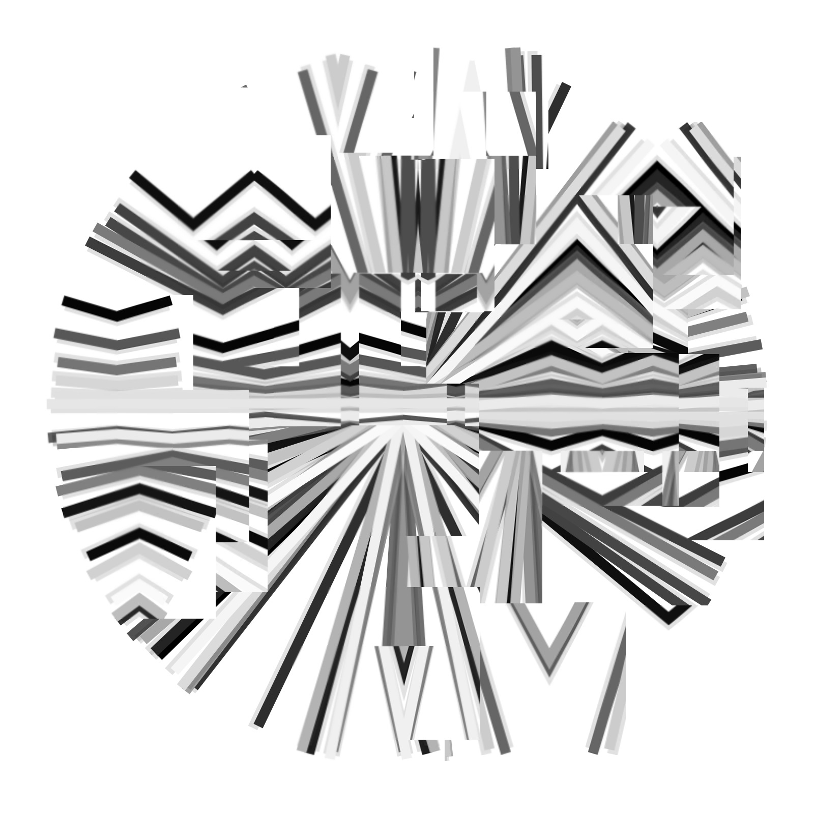


### 2021-01-05 | Do some code golf!

#### How little code can you write to make something interesting? I made noisy black dots.

Links: [Code](https://github.com/matthias-jaeger-net/genuary2021/tree/main/code/genuary-05), [Live Demo](https://matthias-jaeger-net.github.io/genuary2021/code/genuary-05/)


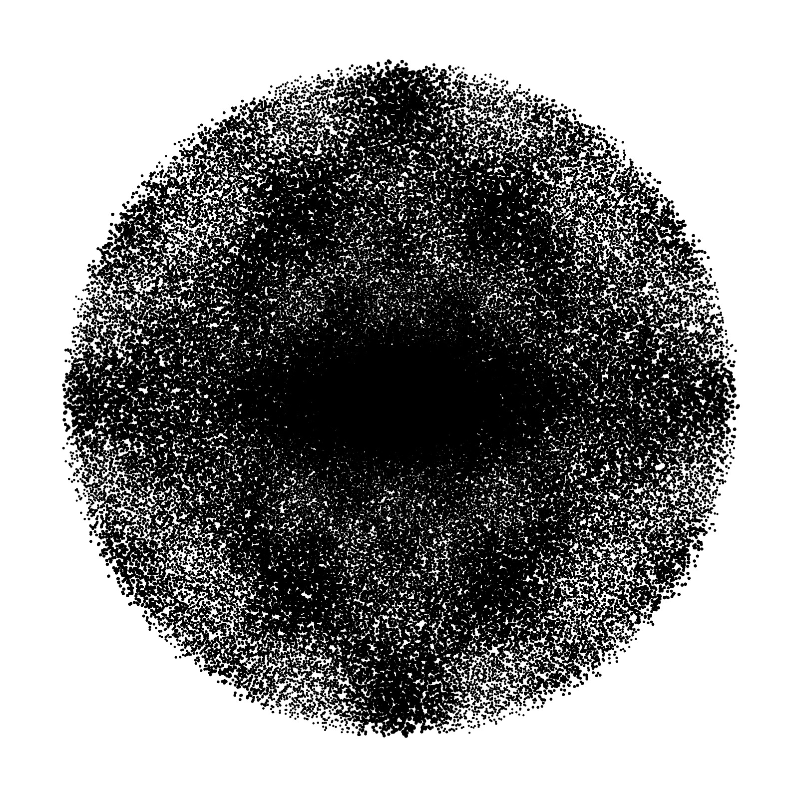


### 2021-01-06 | Triangle subdivision

#### Wrote several functions that help me get this simple animation done. The geometry you see is calculated from 3 given vectors and rotated, styled and diplayed in a p5 WEBGL canvas.

Links: [Code](https://github.com/matthias-jaeger-net/genuary2021/tree/main/code/genuary-06), [Live Demo](https://matthias-jaeger-net.github.io/genuary2021/code/genuary-06/)

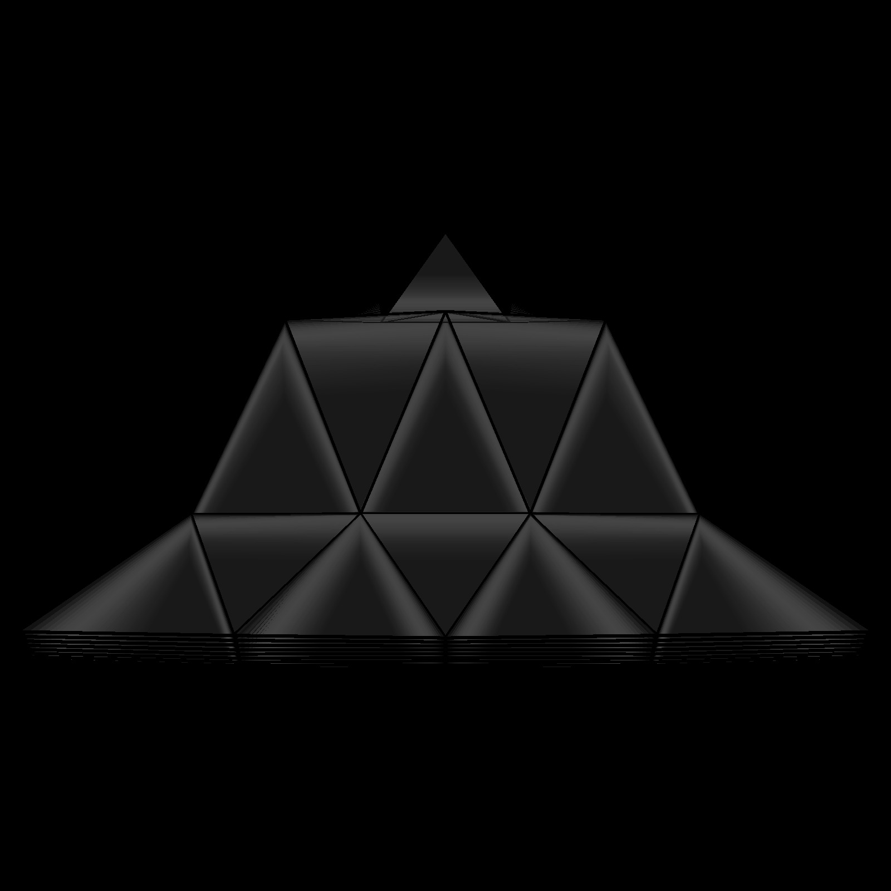


### 2021-01-07 | Generate some rules, then follow them by hand on paper
```
Take a paper
Take a pen
Move at a random location
Pen down
Move at a random location
Wiggle or not
Pen up
Look at the paper
Repeat until MAXLINES
Then start filling voids with black
```


*Permanent marker on 300x400 mm, 200g, Watercolor paper*


### 2021-01-08 | Curve only

#### Inspired by floral drawings and minimalist aestethics I imagine a wild composition of blades of grass in a virtual landscape.

Links: [Code](https://github.com/matthias-jaeger-net/genuary2021/tree/main/code/genuary-08), [Live Demo](https://matthias-jaeger-net.github.io/genuary2021/code/genuary-08/)

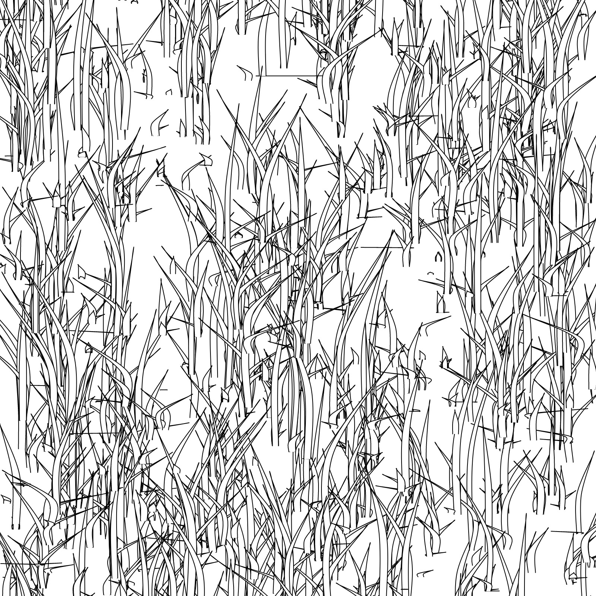


### 2021-01-09 | Interference patterns

#### Simple circles moving on the screen shape beautiful patterns.

Links: [Code](https://github.com/matthias-jaeger-net/genuary2021/tree/main/code/genuary-09), [Live Demo](https://matthias-jaeger-net.github.io/genuary2021/code/genuary-09/)

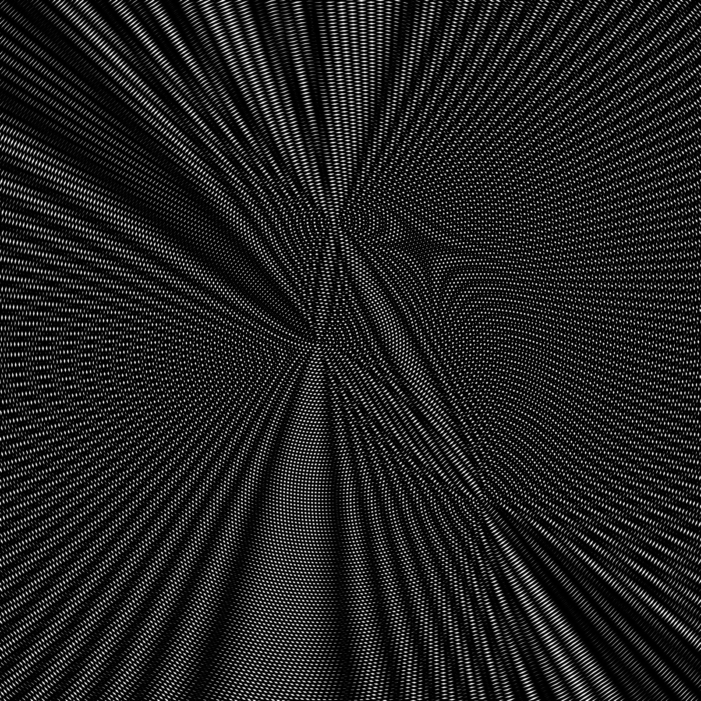


### 2021-01-10 | TREE

#### I took a pen and sketched a landscape with a lone tree in the center. I imagine each branch would grow more branches, rotated by an angle. This is the classic recursive implementation, similar to the examples available online, but in this one I took great attention to the rendering. I designed the braches to respect the level of recusion. A semi-random structure of leaves with polygons remind f foliage. To give it more depth I added a ground and a sky. For these I used  horizontal lines modified by perlin noise to get that hand-drawn, sketchy look I wanted.

Links: [Code](https://github.com/matthias-jaeger-net/genuary2021/tree/main/code/genuary-10), [Live Demo](https://matthias-jaeger-net.github.io/genuary2021/code/genuary-10/)

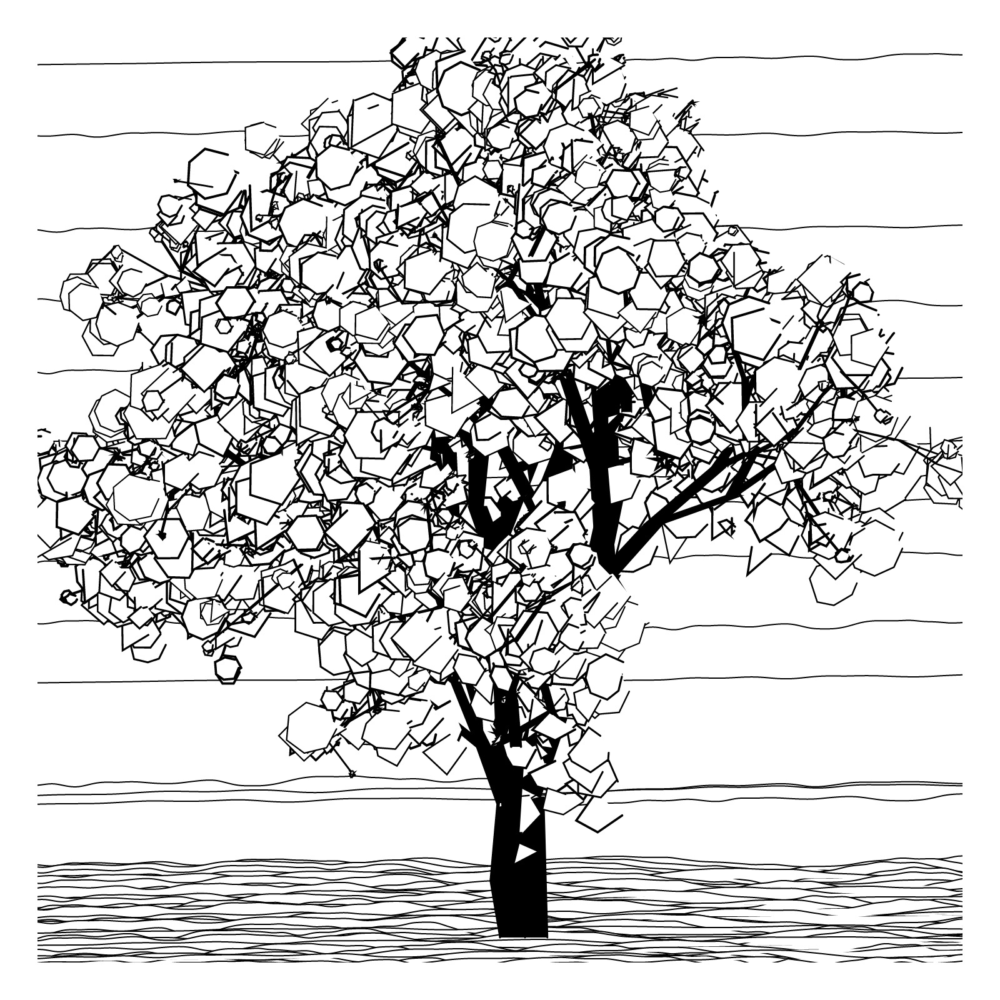


### 2021-01-11 | Use something other than a computer as an autonomous process (or use a non-computer random source).

#### I didn't have a quartz to swing nor a sensor. Also I didn't feel like throwing a dice so I used two abitrairy landscape images as a lookup table. I measured all brightness values and divided by 255. What I end up is a single array with floating point numbers between 0 and 1. These numbers I used as a scaler for the radius of point rotating on a circle.

Links: [Code](https://github.com/matthias-jaeger-net/genuary2021/tree/main/code/genuary-11), [Live Demo](https://matthias-jaeger-net.github.io/genuary2021/code/genuary-11/)

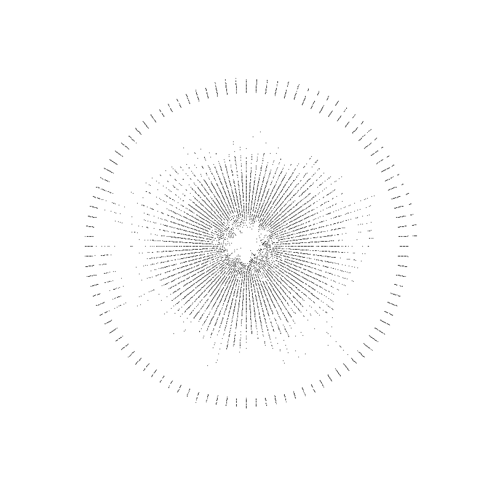


### 2021-01-12 | Use an API

#### **"I let go of what I was holding onto"**. In these images I combined the Google Fonts API and my glitch effects library together.

Links: [Code](https://github.com/matthias-jaeger-net/genuary2021/tree/main/code/genuary-12), [Live Demo](https://matthias-jaeger-net.github.io/genuary2021/code/genuary-12/)

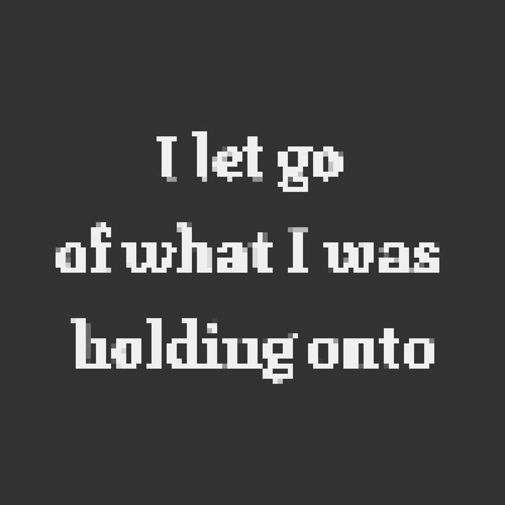


### 2021-01-13 | Do not repeat.

#### A rather impossible task in programming. I kept repetitions it to the bare minimum in this short program. I did not use for loops, while loops or recursion. I'm using three different shapes, too not repeat myself too much. It's a very simple geometric composition, but the colors are randomly chosen from a list with three defined and one generated color.

Links: [Code](https://github.com/matthias-jaeger-net/genuary2021/tree/main/code/genuary-13), [Live Demo](https://matthias-jaeger-net.github.io/genuary2021/code/genuary-13/)

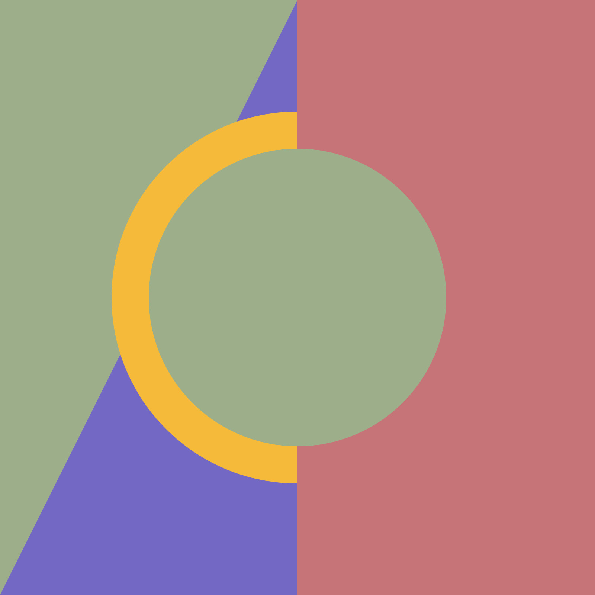


### 2021-01-14 | SUBDIVISION

#### Hard to explain and very long, but basically a polygonized subdivison of a virtual circle segemented from the outside to the inside

Links: [Code](https://github.com/matthias-jaeger-net/genuary2021/tree/main/code/genuary-14), [Live Demo](https://matthias-jaeger-net.github.io/genuary2021/code/genuary-14/)

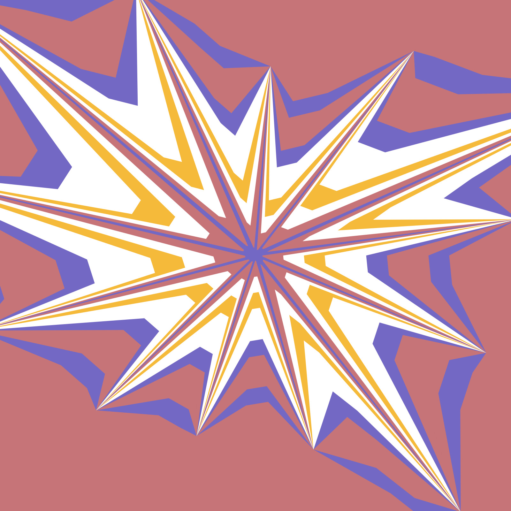


### 2021-01-15 | Let someone else decide the general rules of your piece.

#### "Make snowflakes, each one different", requested by Sabine led me to this abstraction. I started of a simple class wrapping a randomized polygon, that can fall down. Then I made a system of many falling flakes, each flake with a different speed. As the flakes fall they leave colorful traces on the canvas resulting in an eveer-changing graphical image.

Links: [Code](https://github.com/matthias-jaeger-net/genuary2021/tree/main/code/genuary-15), [Live Demo](https://matthias-jaeger-net.github.io/genuary2021/code/genuary-15/)

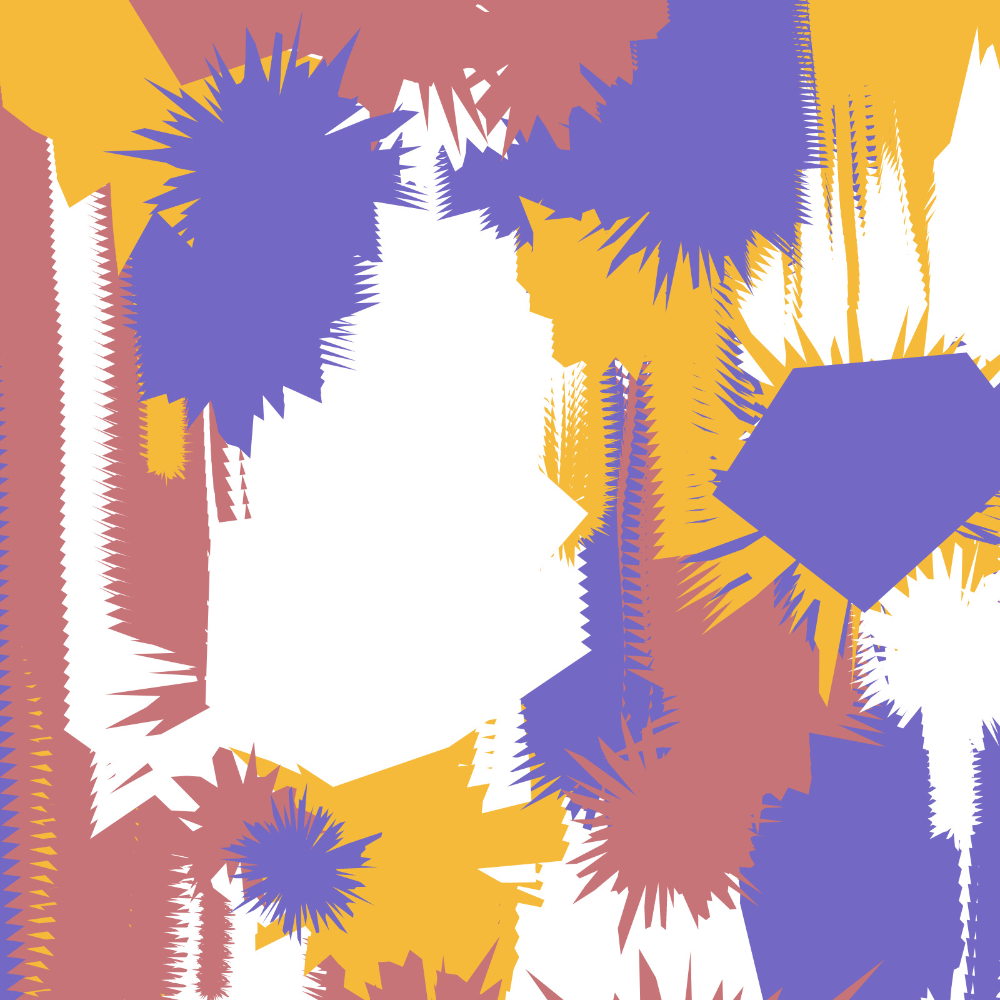


### 2021-01-16 | Circles only

#### A noisy and moody animation of points along a circle

Links: [Code](https://github.com/matthias-jaeger-net/genuary2021/tree/main/code/genuary-16), [Live Demo](https://matthias-jaeger-net.github.io/genuary2021/code/genuary-16/)

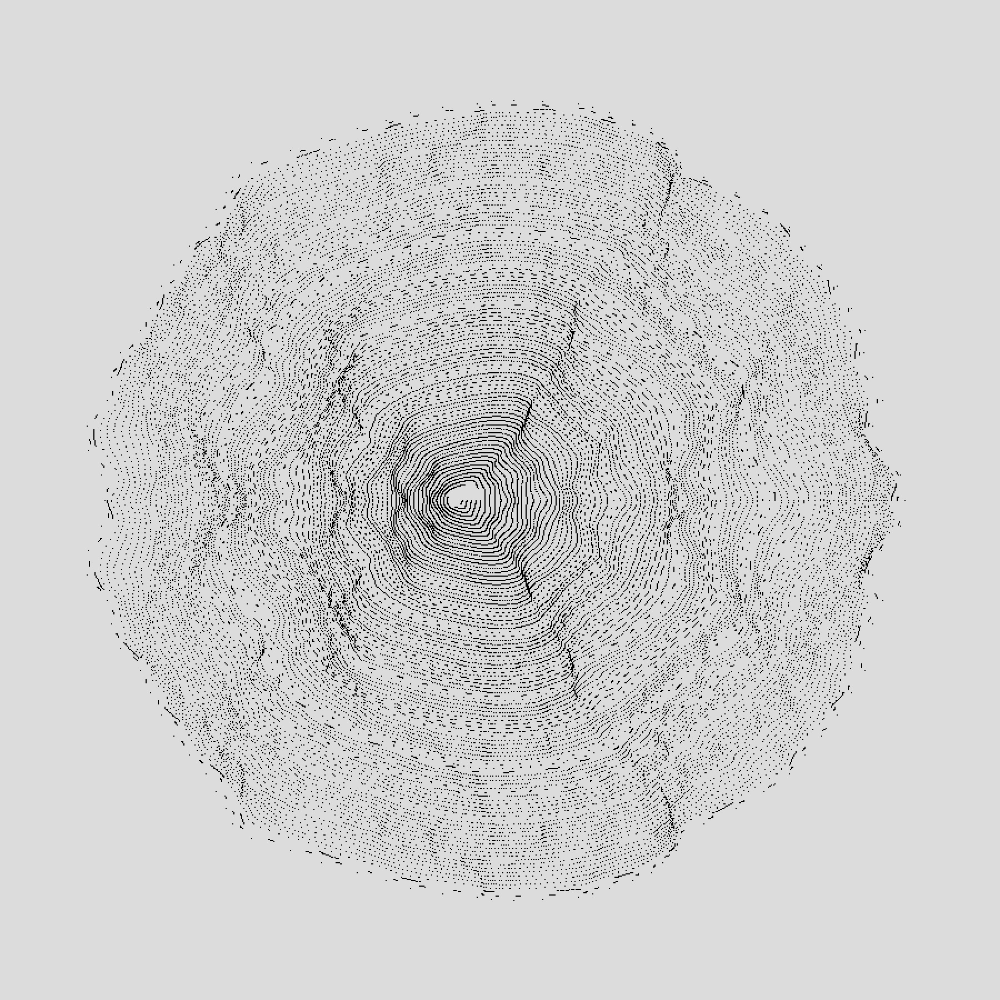


### 2021-01-17 |  Draw a line, pick a new color, move a bit.

#### Flowing curvy lines with a 2D Perlin noise field, picking a random color from a list.

Links: [Code](https://github.com/matthias-jaeger-net/genuary2021/tree/main/code/genuary-17), [Live Demo](https://matthias-jaeger-net.github.io/genuary2021/code/genuary-17/)

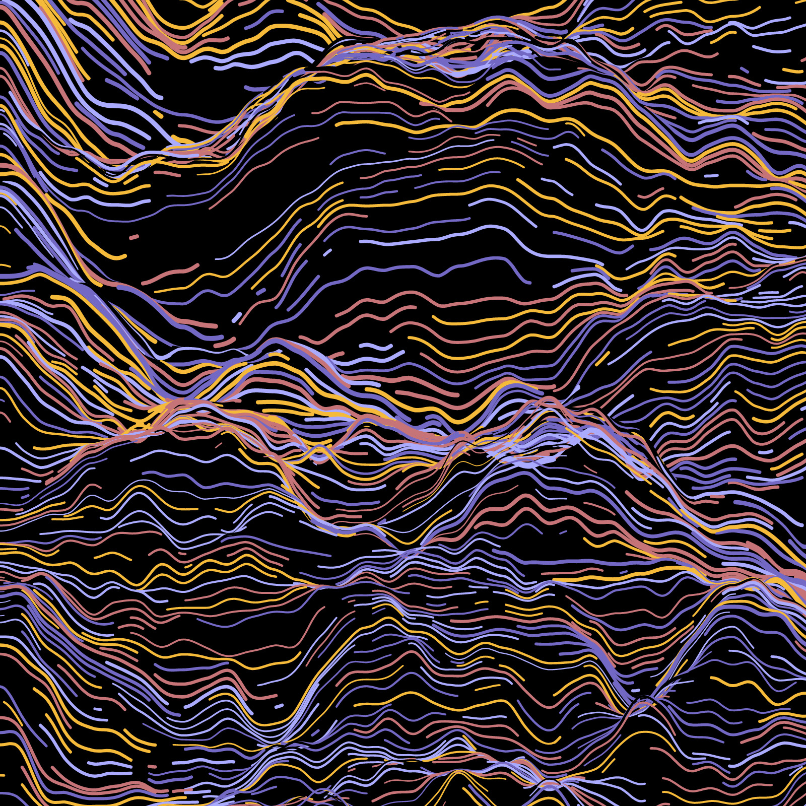


### 2021-01-18 | One process grows, another process prunes.

Shrinking the radius and increasing a random offset while the animation goes on

Links: [Code](https://github.com/matthias-jaeger-net/genuary2021/tree/main/code/genuary-18), [Live Demo](https://matthias-jaeger-net.github.io/genuary2021/code/genuary-18/)

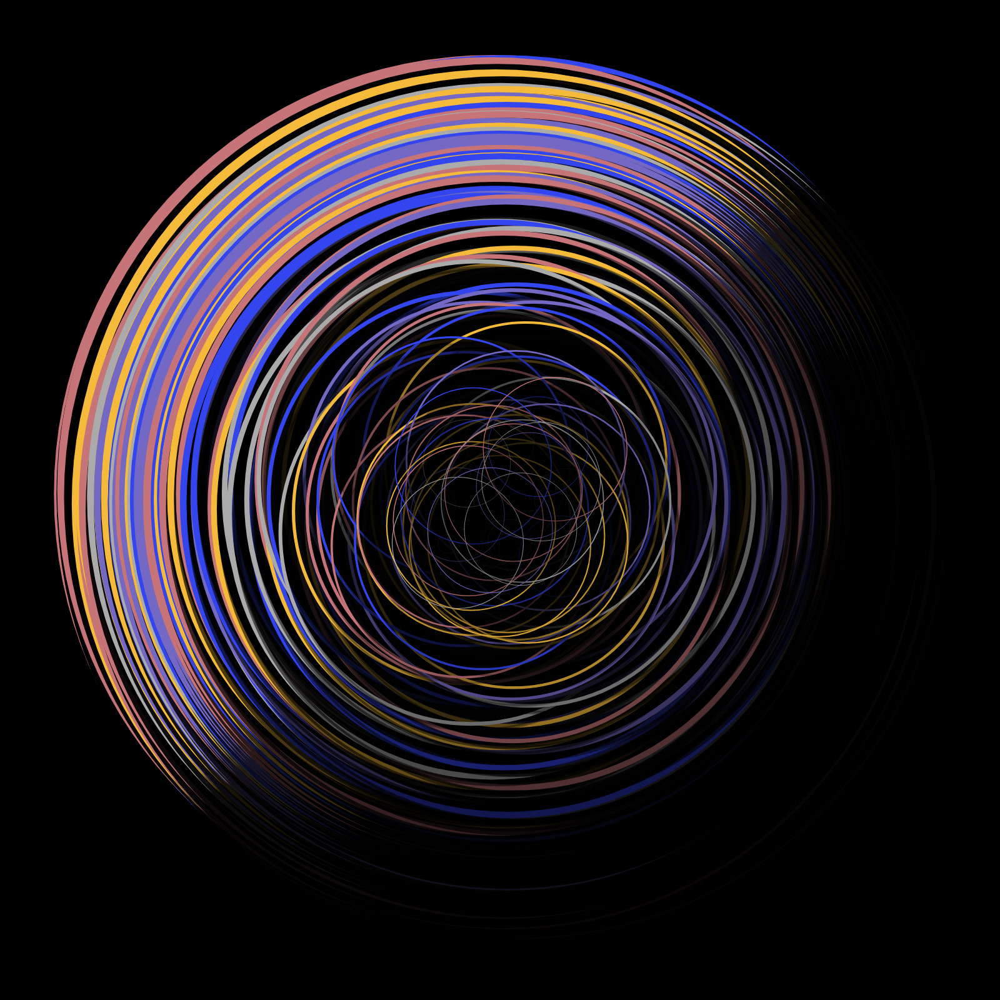


### 2021-01-19 | Increase the randomness along the Y-axis.

#### Used noise to create colorful lines that dissolve into points in the lower half of the composition.

Links: [Code](https://github.com/matthias-jaeger-net/genuary2021/tree/main/code/genuary-19), [Live Demo](https://matthias-jaeger-net.github.io/genuary2021/code/genuary-19/)


### 2021-01-20 | No loops.

#### I used quite a bit of recursion and perlin noise multitplied by a small value to create today's images. Otherwise this is built from my recursive tree example, but uses circles on the calculated endpoints. The script seems unpredictable but produces beautiful complex images.

Links: [Code](https://github.com/matthias-jaeger-net/genuary2021/tree/main/code/genuary-20), [Live Demo](https://matthias-jaeger-net.github.io/genuary2021/code/genuary-20/)

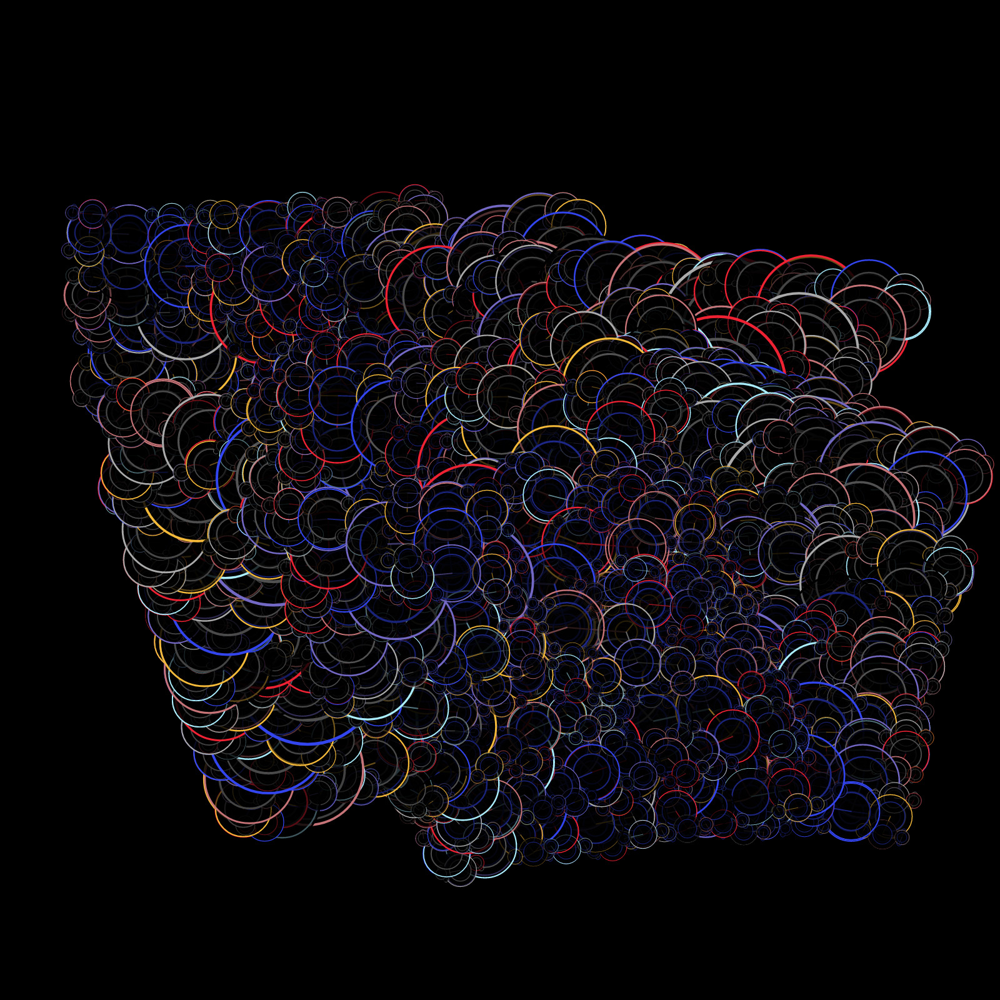


### 2021-01-21 | The function f

#### This time I had to modify the given function f and added an exit condition to prevent too much recursion. After that and keeping my sanity I started jamming with circles and colors too make this geometric image for you after all.

Links: [Code](https://github.com/matthias-jaeger-net/genuary2021/tree/main/code/genuary-21), [Live Demo](https://matthias-jaeger-net.github.io/genuary2021/code/genuary-21/)

```
function f(x) {
    DRAW(x);
    f(1 * x / 4);
    f(2 * x / 4);
    f(3 * x / 4);
}
```

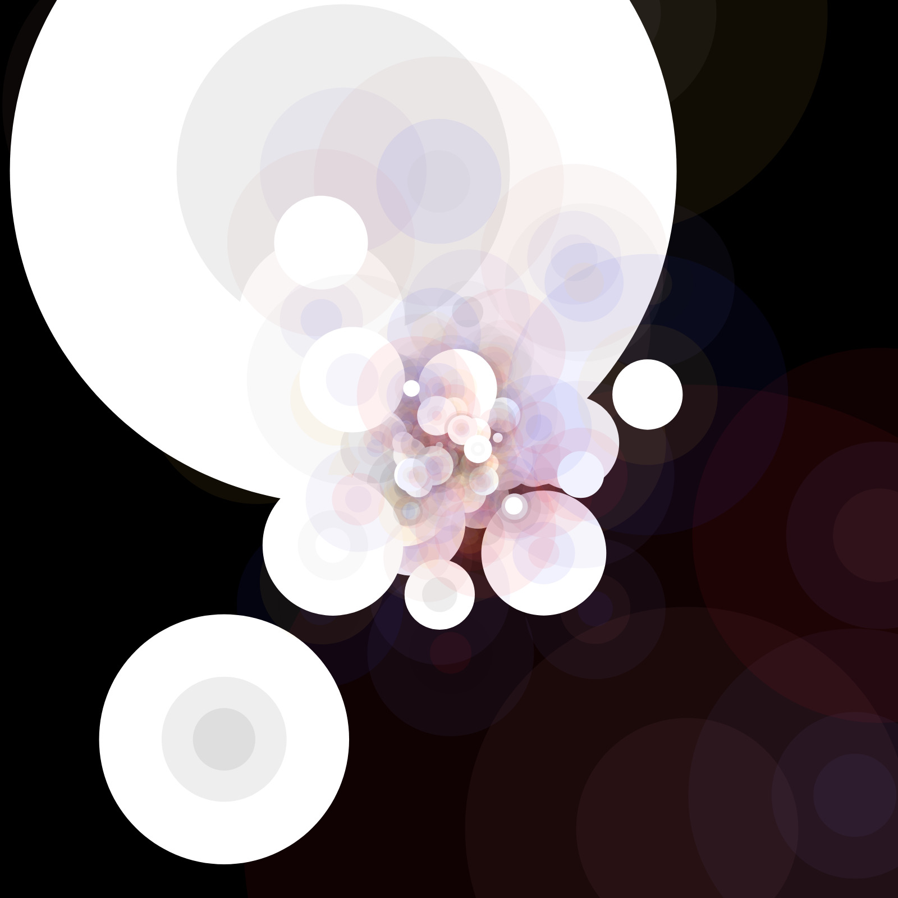


### 2021-01-22 | Draw a line. Wrong answers only.

#### For today's program I refactored an older line graphic program (2018-2020) to use the color-scheme I have been working on latley. The script allows you to draw lines with your mouse, but not like you would expect. A certain number of randomly orientated unit vectors is multiplied by a randomly picked constant length. All generated lines are tested and only those that do not intersect an existing line-segement are permitted in the graph.

Links: [Code](https://github.com/matthias-jaeger-net/genuary2021/tree/main/code/genuary-22), [Live Demo](https://matthias-jaeger-net.github.io/genuary2021/code/genuary-22/)

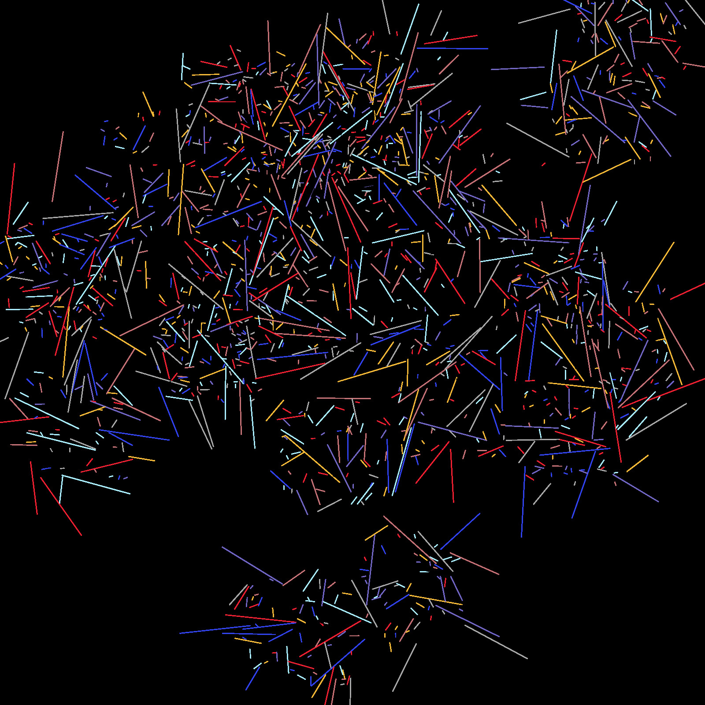


### 2021-01-23 | #264653 #2a9d8f #e9c46a #f4a261 #e76f51, no gradients.

#### I used todays colors on rounded rectangles in a perfect loop animation. The design is my own thing but I used a tutorial read (link below). After having the basic structure down I modified it with 2D noise and trigonometric functions. A for loop is going over the all colors and uses the numbers to render this colorful animation on stage. Used ffmpeg over the command line to convert the image output to this video.

Links: [Code](https://github.com/matthias-jaeger-net/genuary2021/tree/main/code/genuary-23), [Live Demo](https://matthias-jaeger-net.github.io/genuary2021/code/genuary-23/)

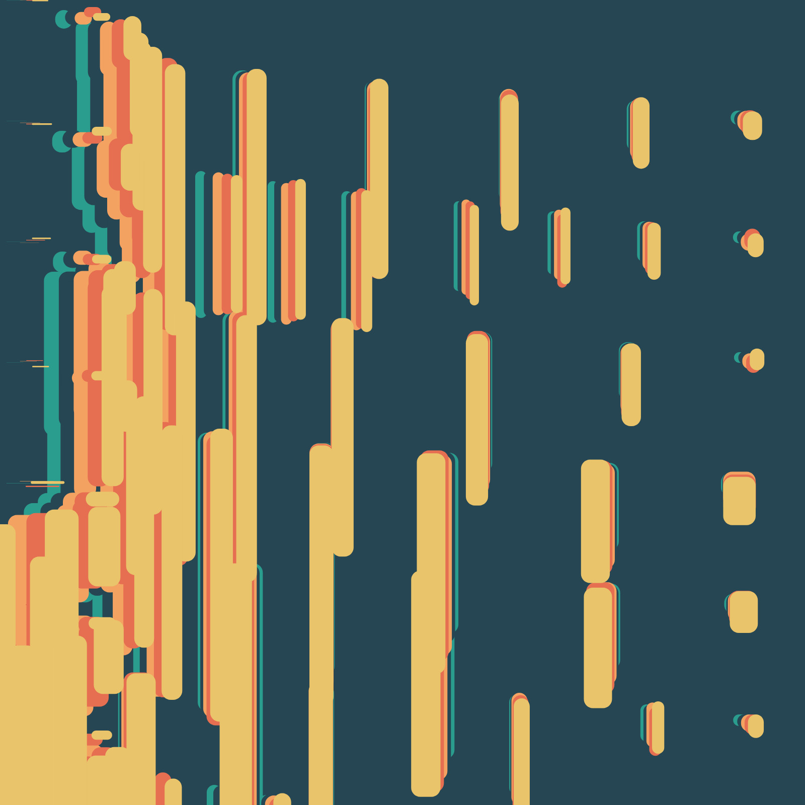


### 2021-01-24 | 500 lines.

#### In color, with noise & animated. :D

Links: [Code](https://github.com/matthias-jaeger-net/genuary2021/tree/main/code/genuary-24), [Live Demo](https://matthias-jaeger-net.github.io/genuary2021/code/genuary-24/)

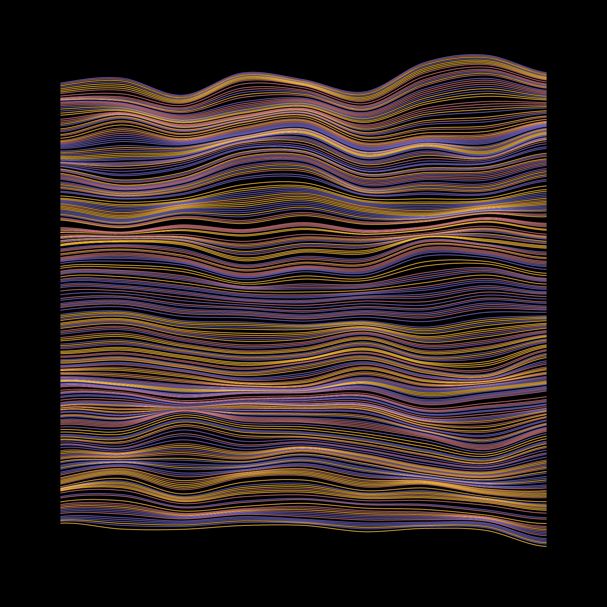


### 2021-01-25 | Make a grid of permutations of something.

#### Unexpected results to come, the future is ahead. I started with a grid and ended with a diffusion-limited aggregation pattern in color.

Links: [Code](https://github.com/matthias-jaeger-net/genuary2021/tree/main/code/genuary-25), [Live Demo](https://matthias-jaeger-net.github.io/genuary2021/code/genuary-25/)

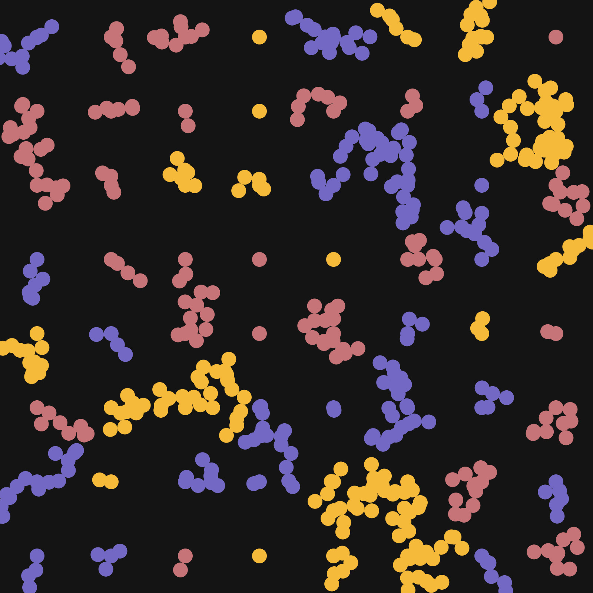


### 2021-01-26 | 2D Perspective.

#### A randomly generated arrangement of colorful boxes in a WEBGL canvas appears to me like a perspective view in an asian megacity at night.

Links: [Code](https://github.com/matthias-jaeger-net/genuary2021/tree/main/code/genuary-26), [Live Demo](https://matthias-jaeger-net.github.io/genuary2021/code/genuary-26/)

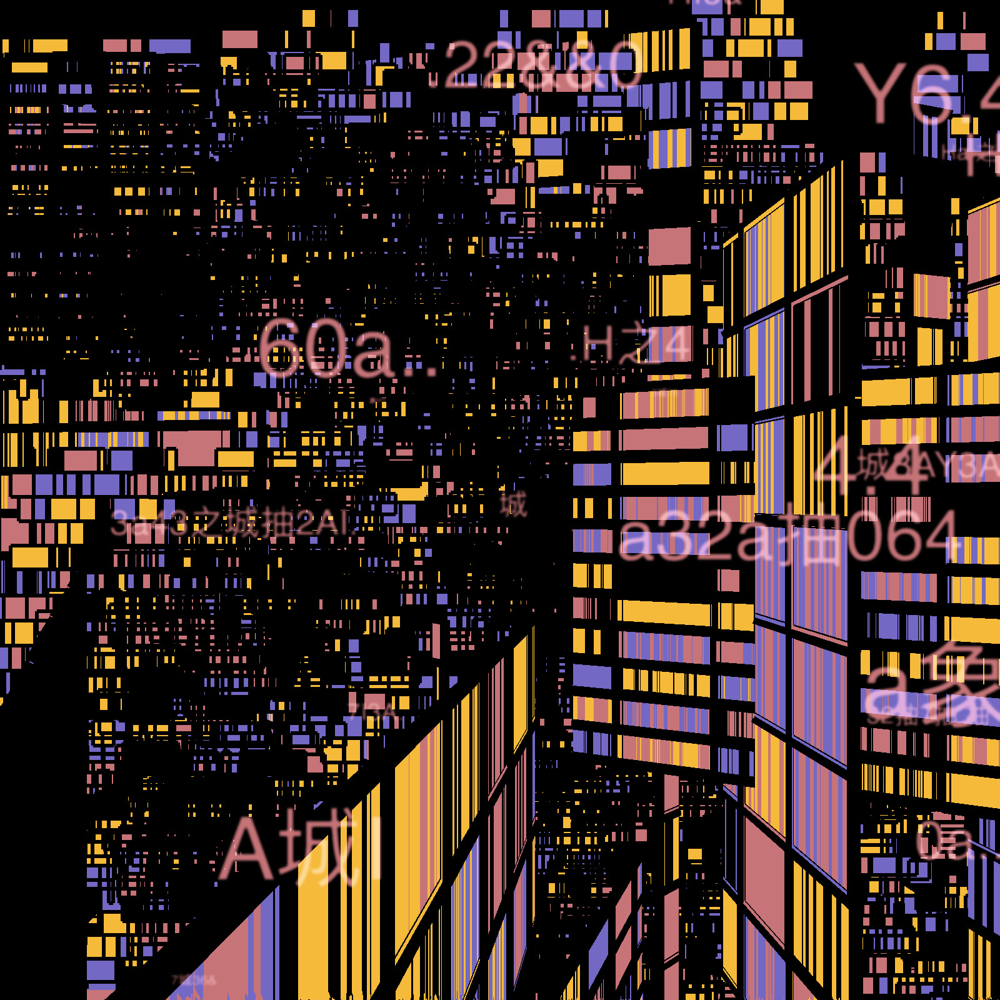


### 2021-01-27 | Monochrome gradients without lines.

#### Wrote a function that returns an image with a linear gradient from black to white. Then used it in a composition loop.

Links: [Code](https://github.com/matthias-jaeger-net/genuary2021/tree/main/code/genuary-27), [Live Demo](https://matthias-jaeger-net.github.io/genuary2021/code/genuary-27/)

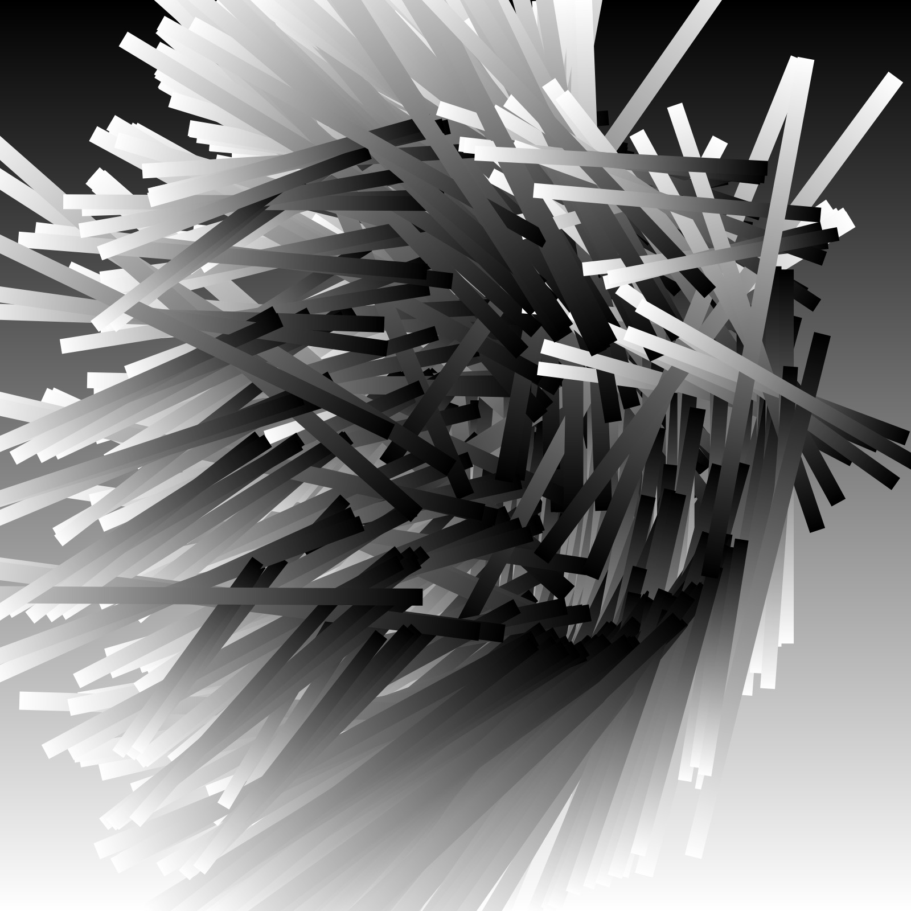


### 2021-01-28 | Use sound.

#### This images visualize the frequency spectrum of live audio input over time. I reworked the p5.sound example code from a linear to a circular design and don't clear the background. As an input sound I used the smooth pop song "Night Train" from *https://soundcloud.com/buebuemusic*


Links: [Code](https://github.com/matthias-jaeger-net/genuary2021/tree/main/code/genuary-28), [Live Demo](https://matthias-jaeger-net.github.io/genuary2021/code/genuary-28/)

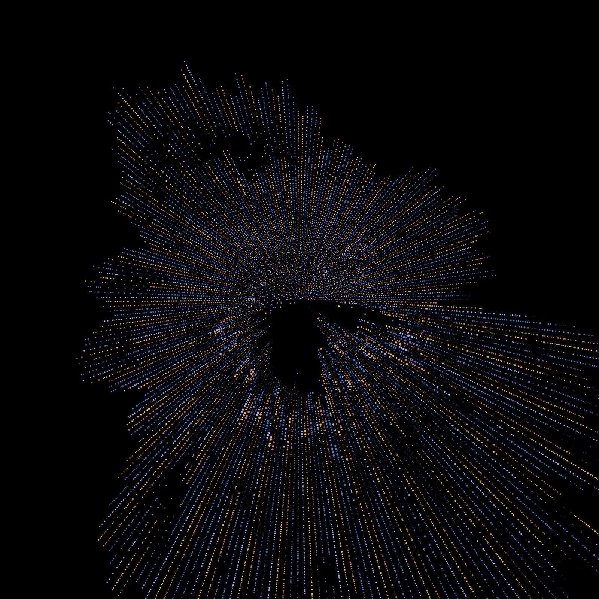


### 2021-01-29 | Any shape, none can touch.

#### Colorful circles growing in a circle until they touch any circle inside a circle.

Links: [Code](https://github.com/matthias-jaeger-net/genuary2021/tree/main/code/genuary-29), [Live Demo](https://matthias-jaeger-net.github.io/genuary2021/code/genuary-29/)

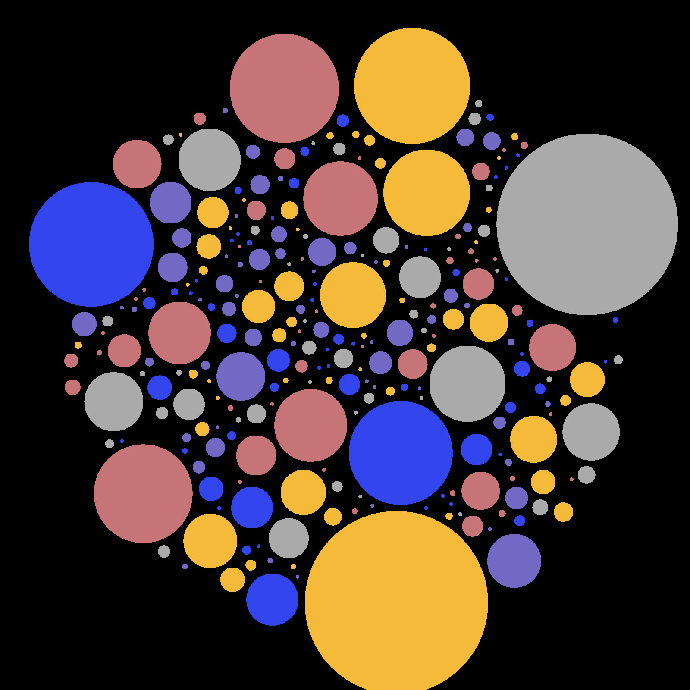


### 2021-01-30 | Replicate a natural concept (e.g. gravity, flocking, path following).

#### I refactored the demonstration of Craig Reynolds "Flocking" behavior by Daniel Shiffman to a non animated, colorful version that gives me a single static image every time I call it.

Links: [Code](https://github.com/matthias-jaeger-net/genuary2021/tree/main/code/genuary-30), [Live Demo](https://matthias-jaeger-net.github.io/genuary2021/code/genuary-30/)


### 2021-01-31 | Finale
```
10 SEARCH FOR "ENO'S OBLIQUE STRATEGIES"
20 OBTAIN ONE
30 THAT IS YOUR PROMPT FOR TODAY
```